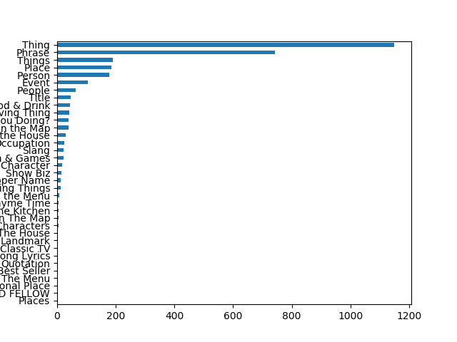
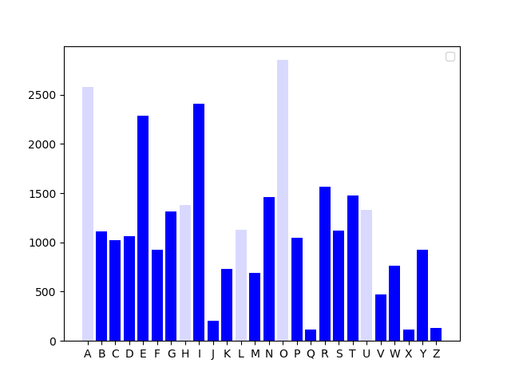

# Wheel Of Fortune Final Question Analysis
A brief study done on the most common letters in Wheel of Fortune final questions. Done in order to learn the Pandas framework.

### Introduction
I conducted this quick study in order to find out which letters are best to choose in the Final Question round of the popular game show Wheel of Fortune. My dad really likes to watch Wheel of Fortune so I have seen way too many episodes for what is honestly a really boring show. Like all of us sitting in the comfort of our own homes watching game shows on TV, I thought I could definitely do better than the chumps they find on the show. So I put myself to the task of proving it by finding the most likely letters to occur in the Final Question round based on category.

### Data
Data was scraped from the Wheel of Fortune Bonus Question Compendium repository available [here](http://www.angelfire.com/mi4/malldirectories/wheel/wheelbonus.html)

### Tools used
- Python 3.7
- Pandas Data Manipulation framework
- BeautifulSoup
- Matplotlib

### Results & Conclusion
Here is the distribution of all categories and all letters contained in those puzzles:

  
This shows that the best letters to pick (other than the provided R S T L N E) are G H and D for your consonants and O for your vowel.

Letter distribution by category is shown in the [graphs](graphs/) directory.
