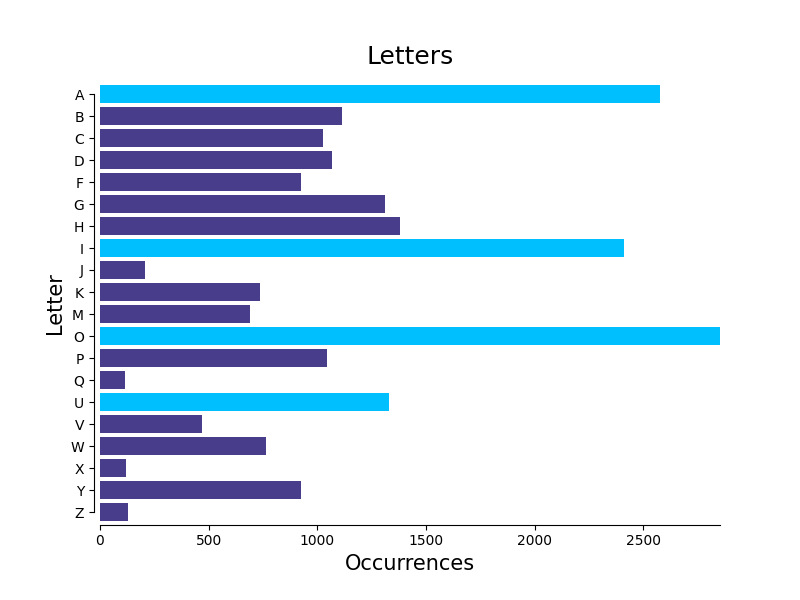
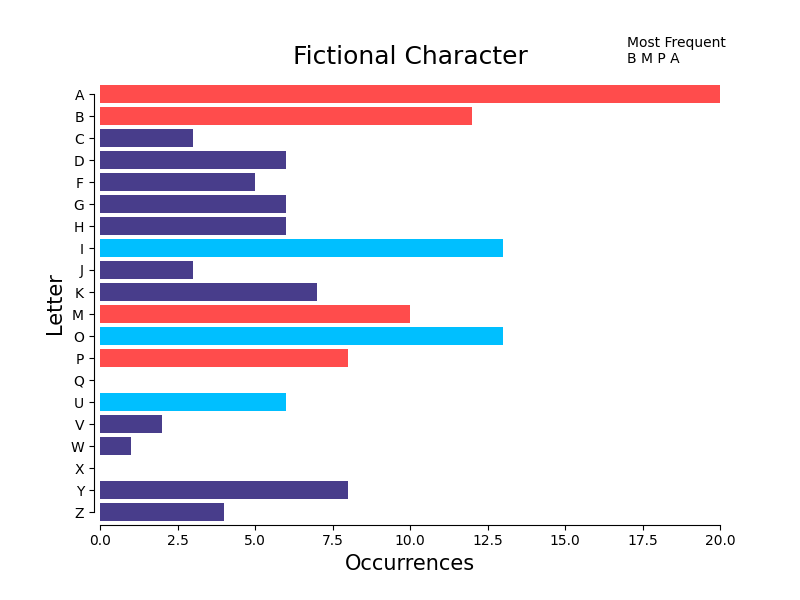
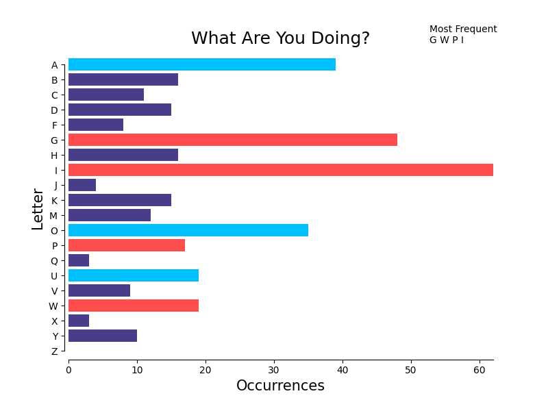

# Wheel Of Fortune Final Question Analysis
A brief study done on the most common letters in Wheel of Fortune Bonus Puzzle.

### Introduction
I conducted this quick study in order to find out which letters are best to choose in the Bonus Puzzle of the popular game show Wheel of Fortune. My dad really likes to watch Wheel of Fortune so I have seen way too many episodes for what is honestly a really boring show. Like all of us sitting in the comfort of our own homes watching game shows on TV, I thought I could definitely do better than the chumps they find on the show. So I put myself to the task of proving it by finding the most likely letters to occur in the Final Question round based on category.

### Data
Data was scraped from the Wheel of Fortune Bonus Question Compendium repository available [here](http://www.angelfire.com/mi4/malldirectories/wheel/wheelbonus.html)

### Tools used
- Python 3.7
- Pandas Data Manipulation framework
- BeautifulSoup
- Matplotlibd

### Results & Conclusion
Here is the distribution of all of the categories given in the Bonus Puzzle:
  
As one can see, the distribution is pretty top heavy, with the majority of the Bonus Puzzles being either a 'Thing'/'Things' or 'Phrase'. However, there are a significant amount of other rarely occurring categories.

Now let's look at the occurrence of letters in all Bonus Puzzles:
  
This shows that the best letters to pick overall (other than the provided *R*, *S*, *T*, *L*, *N*, and *E*) are *G*, *H*, and *D* for the consonants and *O* for the vowel. However, according to [Lexico](https://www.lexico.com/explore/which-letters-are-used-most) the most common letters in the English language (excluding *R*, *S*, *T*, *L*, *N*, and *E*) are *C*, *D*, and *P* for the consonants and *A* as the vowel. This goes to show that the producers of the show are choosing puzzles that are intentionally difficult to guess which is surprising to absolutely no one. In fact, out of the most commonly occuring consonants in the Bonus Puzzle mentioned above, none are even in the top half of frequency in the English language, while the most commonly occuring vowel *O* is only the 4th most common vowel! (reminder that there are only 5 vowels)

However, there are some weird categories that are harder to prepare for. Take the 'Fictional Character' category for example:
  
In this category, you are better off choosing *B*, *M*, *Y*, and *A* which is a little bizarre.

If you are lucky, you will get a slightly easier category like 'What Are You Doing?':
  
In this category, you can almost be sure that one of the words will be ending in "-ing", which is reflected in the graph. This means you can save your guesses for other letters.

Letter distribution for all categories is shown in the [graphs](graphs/) directory.
